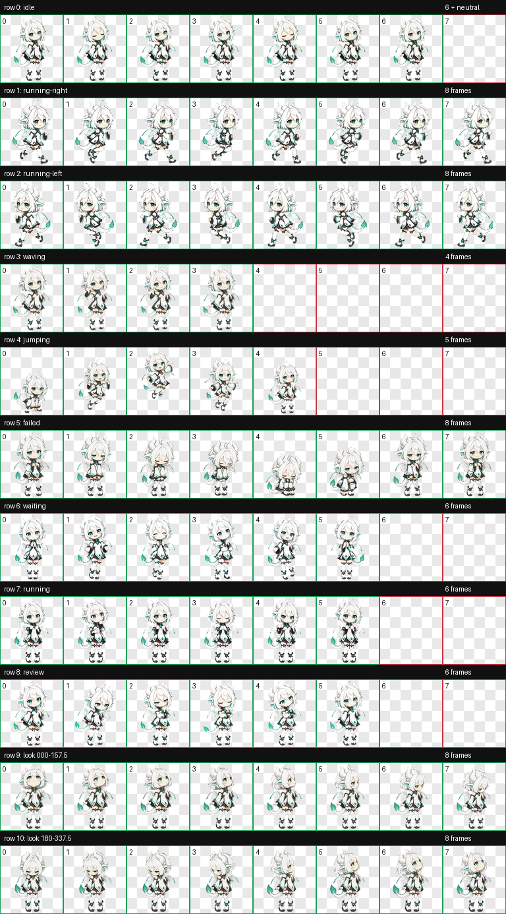

# Lumina — Codex Pet

Lumina is a white-haired anime dragon girl created as a custom animated pet for the ChatGPT/Codex desktop experience.

## Included files

- `spritesheet.webp` — Codex-compatible v2 animated sprite atlas
- `pet.json` — pet metadata and spritesheet configuration
- `contact-sheet.png` — preview of the standard animation states
- `look-directions.png` — preview of the 16 look directions
- `validation.json` — atlas validation report
- `run-summary.json` — generation and QA summary

## Install on Windows

1. Create `%USERPROFILE%\.codex\pets\lumina` if it does not exist.
2. Copy `spritesheet.webp` and `pet.json` into that folder.
3. Open **Settings → Pets** in the desktop app, select **Refresh**, then choose **Lumina**.

The pet uses `spriteVersionNumber: 2` and is stored locally on your computer.

## 中文说明

Lumina 是一只白发动漫龙娘 Codex 宠物。本仓库保存当前稳定版精灵图、宠物配置、动作预览和验证结果。

Windows 安装目录：`%USERPROFILE%\.codex\pets\lumina`

完整安装、启用、状态动画和故障排查说明请阅读：[中文使用手册](使用手册.md)。
